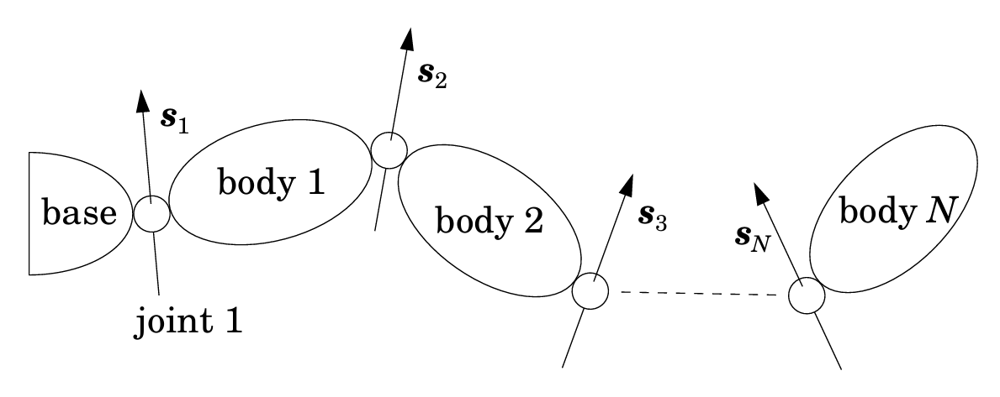

# Recursive Newton–Euler Algorithm (RNEA)

- Reference textbooks for RNEA
    - <a name="fs08">[1]</a> [(Featherstone 2008) Rigid body dynamics algorithms](https://link.springer.com/book/10.1007/978-1-4899-7560-7)
    - <a name="mr17">[2]</a> [(Kevin Lynch 2017) Modern Robotics: Mechanics, Planning, and Control](https://hades.mech.northwestern.edu/images/7/7f/MR.pdf)
---

## 1. Brief summary

The **Recursive Newton–Euler Algorithm (RNEA)** computes the inverse dynamics of a robot:

$$
\tau = \text{ID}(\text{model}, \, q, \, \dot q, \, \ddot q)
$$

That is, given:

- joint positions $q$
- joint velocities $\dot q$
- joint accelerations $\ddot q$

it computes the required joint torques/forces $\tau$.

The key idea is to avoid explicitly forming the mass matrix $M(q)$. Instead, RNEA performs:

1. a **forward pass** to propagate **body twists** and **body accelerations** from root to leaves,
2. a **local rigid-body dynamics step** to compute each link's required **body wrench**,
3. a **backward pass** to propagate **subtree wrenches** from leaves to root and extract joint torques.

In modern robotics language:

- motion lives in the twist space $se(3)$,
- forces live in the wrench space $se(3)^*$,
- transforms of twists use $\text{Ad}(\cdot)$,
- transforms of wrenches use $\text{Ad}^*(\cdot)$,
- instantaneous transport of twists uses $\text{ad}(\cdot)$,
- instantaneous transport of wrenches uses $\text{ad}^*(\cdot)$.

A useful picture to keep in mind is the generic serial kinematic chain below <a href="#fs08">[1]</a>. It matches the parent-child recursion used by RNEA: each joint $i$ connects body $i-1$ to body $i$, and the joint screw axis $S_i$ in the equations below is the same geometric object sketched as $s_i$ in the figure.

In the rest of this note, we use the body-frame convention, so $S_i$ is expressed in the child/body frame of link $i$.

---

## 2. Objects and notation

For link $i$:

- $\mathcal{V}_i \in \mathbb{R}^6$: body twist of link $i$, expressed in the body frame of link $i$
- $\dot{\mathcal{V}}_i \in \mathbb{R}^6$: body acceleration of link $i$, expressed in the body frame of link $i$
- $\mathcal{F}_i \in \mathbb{R}^6$: body wrench acting on link $i$
- $I_i \in \mathbb{R}^{6\times 6}$: body spatial inertia of link $i$
- $S_i \in \mathbb{R}^6$: **body screw axis** of joint $i$, expressed in the child/body frame
- $i-1$: parent body index of body $i$ in a serial chain
- $\text{children}(i)$: children of body $i$

We write twists and wrenches as:

$$
\mathcal{V} = \begin{bmatrix} \omega \\ v \end{bmatrix},
\qquad
\mathcal{F} = \begin{bmatrix} m \\ f \end{bmatrix}
$$

where:

- $\omega$: angular velocity
- $v$: linear velocity of the frame origin
- $m$: moment
- $f$: force

---

## 3. Forward pass: body twist recursion

The body twist recursion is:

$$
\mathcal{V}_i = \text{Ad}_{T_{i,i-1}} \mathcal{V}_{i-1} + S_i \dot q_i
$$

Interpretation:

- $T_{i,i-1}$: the pose of frame $\{i-1\}$ as expressed in frame $\{i\}$, so $\text{Ad}_{T_{i,i-1}}$ re-expresses a spatial motion from frame $\{i-1\}$ coordinates into frame $\{i\}$ coordinates
- $\text{Ad}_{T_{i,i-1}} \mathcal{V}_{i-1}$ is the **parent link's twist re-expressed in the child frame**
- $S_i \dot q_i$ is the **relative joint twist** generated by the motion of joint $i$

### Insight

The child body twist is:

> inherited parent motion + relative joint motion.

This is the twist-space statement of rigid kinematics.

---

## 4. Forward pass: body acceleration recursion

Differentiate the twist recursion in moving body coordinates:

$$
\dot{\mathcal{V}}_i = \text{Ad}_{T_{i,i-1}} \dot{\mathcal{V}}_{i-1} + S_i \ddot q_i + \text{ad}_{\mathcal{V}_i}(S_i \dot q_i)
$$

Interpretation:

- $\text{Ad}_{T_{i,i-1}} \dot{\mathcal{V}}_{i-1}$: inherited parent acceleration
- $S_i \ddot q_i$: direct joint acceleration term
- $\text{ad}_{\mathcal{V}_i}(S_i \dot q_i)$: motion-induced correction caused by differentiating the joint twist in a body frame that is itself already moving

### Insight

Each term has a different physical meaning:

- $\text{Ad}_{T_{i,i-1}} \dot{\mathcal{V}}_{i-1}$ is the acceleration body $i$ would have if it were momentarily **welded** to body $i-1$. It is just the parent's acceleration, re-expressed in frame $i$.
- $S_i \ddot q_i$ is the **new relative acceleration injected by joint $i$** through its joint acceleration.
- $\text{ad}_{\mathcal{V}_i}(S_i \dot q_i)$ is the **extra acceleration induced by the body's own current motion** while the joint-rate contribution $S_i \dot q_i$ is being differentiated in moving body coordinates.

So the child body acceleration is:

> inherited parent acceleration + relative joint acceleration + motion-induced correction.

The first term is inherited, the second is actuated, and the third is motion-induced. The third term is the 6D analogue of familiar rotating-frame/Coriolis-type corrections.

---

## 5. Gravity trick

For a fixed-base robot, physically the base twist is zero:

$$
\mathcal{V}_0 = 0
$$

The base's actual acceleration is also zero in the world. However, in RNEA one often initializes:

$$
\dot{\mathcal{V}}_0 = -g
$$

This is a **fictitious initialization** used to fold gravity into the acceleration recursion instead of adding gravitational wrench terms body-by-body.

So:

- physical fixed base: $\mathcal{V}_0 = 0$, actual $\dot{\mathcal{V}}_0 = 0$
- algorithm initialization: $\mathcal{V}_0 = 0$, recursive seed $\dot{\mathcal{V}}_0 = -g$

Both produce the same final gravity torques.

---

## 6. Local rigid-body dynamics: required body wrench

Once $\mathcal{V}_i$ and $\dot{\mathcal{V}}_i$ are known, the required body wrench of link $i$ is:

$$
\mathcal{F}_i^{\text{body}} = I_i \dot{\mathcal{V}}_i + \text{ad}_{\mathcal{V}_i}^*(I_i \mathcal{V}_i)
$$

If an external wrench $\mathcal{F}_i^{ext}$ acts on the link, subtract it:

$$
\mathcal{F}_i = I_i \dot{\mathcal{V}}_i + \text{ad}_{\mathcal{V}_i}^*(I_i \mathcal{V}_i) - \mathcal{F}_i^{ext}
$$

Interpretation:

- $I_i \dot{\mathcal{V}}_i$: inertial wrench from acceleration
- $I_i \mathcal{V}_i$: momentum
- $\text{ad}_{\mathcal{V}_i}^*(I_i \mathcal{V}_i)$: bias wrench caused by differentiating momentum in a moving body frame

### Insight

This is the body-frame Newton–Euler equation. It is the moment where motion information is converted into required force information.

---

## 7. Backward pass: subtree wrench recursion

Let $\mathcal{F}_i^{\uparrow}$ denote the total wrench transmitted from the subtree rooted at body $i$ to its parent.

Then:

$$
\mathcal{F}_i^{\uparrow} = \mathcal{F}_i + \sum_{j \in \text{children}(i)} \text{Ad}_{T_{i,j}}^* \mathcal{F}_j^{\uparrow}
$$

Interpretation:

- the parent must support link $i$'s own wrench demand
- and also every child subtree's wrench demand, transformed into frame $i$

This is why the backward pass goes from leaves to root.

---

## 8. Joint torque extraction

The scalar actuator effort at joint $i$ is the component of the transmitted wrench along the joint screw axis:

$$
\tau_i = S_i^T \mathcal{F}_i^{\uparrow}
$$

This is a power-consistent projection:

$$
\tau_i \dot q_i = (\mathcal{F}_i^{\uparrow})^T (S_i \dot q_i)
$$

So $S_i$ selects the wrench component along the allowed joint motion subspace.

### Insight: actuator effort versus reaction load

The full transmitted wrench $\mathcal{F}_i^{\uparrow}$ does **not** need to be supplied by actuator torque alone.

- $\tau_i = S_i^T \mathcal{F}_i^{\uparrow}$ extracts only the component along the joint's allowed motion subspace.
- The remaining components are **reaction wrench** components enforced by the joint constraints and carried structurally by the links, bearings, and housing.
- Those reaction loads are passed into the parent link, combined with that link's own load, and then transmitted further upward by the same backward recursion.
- As a result, the base/support sees the final net support wrench of the whole chain.

Write the reaction part as a residual wrench $\mathcal{R}_i$ such that

$$
S_i^T \mathcal{R}_i = 0.
$$

Then the motor supplies only the component along the joint's allowed motion subspace

$$
\tau_i = S_i^T \mathcal{F}_i^{\uparrow},
$$

while the residual reaction part is still physically transmitted through the joint structure.

> The actuator supplies only the wrench component along the joint's allowed motion subspace, while the remaining constrained wrench components are carried structurally as reaction loads and transmitted to more proximal links and ultimately to the base/support.

### Example: fully stretched arm under axial end-effector force

Consider an ideal serial arm that is fully stretched, and suppose a pure end-effector force is applied exactly along the arm's own axis.

In that special case:

- the line of action can pass through the joint axes so the moment about each joint axis is zero,
- the corresponding joint torques from that axial force can therefore be zero or very small,
- but the load is still physically present: it is carried as axial reaction load through the links and joints and finally into the base/support.

So the correct statement is not that the load disappears, but that this particular wrench lies largely in the **reaction-load directions** rather than in the actuator-effort directions.

This is also why singular configurations can be deceptive:

- motion authority in some task-space directions becomes poor,
- yet certain external loads in those same directions can still be carried efficiently by the mechanism as structural load.

---

## 9. Full RNEA algorithm with serial-chain parent indexing

I use the Modern Robotics-style parent/body predecessor index $i-1$ in the forward pass, while keeping the explicit accumulated-wrench notation $\mathcal{F}_i^{\uparrow}$ in the backward pass.

### Forward pass

$$
\mathcal{V}_i = \text{Ad}_{T_{i,i-1}} \mathcal{V}_{i-1} + S_i \dot q_i
$$

$$
\dot{\mathcal{V}}_i = \text{Ad}_{T_{i,i-1}} \dot{\mathcal{V}}_{i-1} + S_i \ddot q_i + \text{ad}_{\mathcal{V}_i}(S_i \dot q_i)
$$

$$
\mathcal{F}_i = I_i \dot{\mathcal{V}}_i + \text{ad}_{\mathcal{V}_i}^*(I_i \mathcal{V}_i) - \mathcal{F}_i^{ext}
$$

### Backward pass

$$
\mathcal{F}_i^{\uparrow} = \mathcal{F}_i + \sum_{j \in \text{children}(i)} \text{Ad}_{T_{i,j}}^* \mathcal{F}_j^{\uparrow}
$$

$$
\tau_i = S_i^T \mathcal{F}_i^{\uparrow}
$$

---

## 10. Two-link robot example

Consider a 2-link serial robot with link 1 as parent and link 2 as child.

We use the child-body frame convention.

### 10.1 Setup

Joint screw axes:

$$
S_1 = \begin{bmatrix} 0 \\ 0 \\ 1 \\ 0 \\ 0 \\ 0 \end{bmatrix},
\qquad
S_2 = \begin{bmatrix} 0 \\ 0 \\ 1 \\ 0 \\ 0 \\ 0 \end{bmatrix}
$$

These represent revolute joints about the local $z$-axis.

Base initialization:

$$
\mathcal{V}_0 = 0,
\qquad
\dot{\mathcal{V}}_0 = -g
$$

We denote transforms:

- $T_{1,0}$: parent-to-child transform from base to link 1 frame
- $T_{2,1}$: transform from link 1 frame to link 2 frame

### 10.2 Twist forward pass

For link 1:

$$
\mathcal{V}_1 = \text{Ad}_{T_{1,0}} \mathcal{V}_0 + S_1 \dot q_1 = S_1 \dot q_1
$$

For link 2:

$$
\mathcal{V}_2 = \text{Ad}_{T_{2,1}} \mathcal{V}_1 + S_2 \dot q_2
$$

Interpretation:

- link 1 has only its own joint twist, because the base is fixed
- link 2 inherits link 1 motion, re-expressed in frame 2, then adds its own joint twist

### 10.3 Acceleration forward pass

For link 1:

$$
\dot{\mathcal{V}}_1 = \text{Ad}_{T_{1,0}} \dot{\mathcal{V}}_0 + S_1 \ddot q_1 + \text{ad}_{\mathcal{V}_1}(S_1 \dot q_1)
$$

Since $\mathcal{V}_1 = S_1 \dot q_1$, the last term is:

$$
\text{ad}_{\mathcal{V}_1}(S_1 \dot q_1) = \text{ad}_{S_1 \dot q_1}(S_1 \dot q_1)=0
$$

because the Lie bracket of a twist with itself is zero.

So:

$$
\dot{\mathcal{V}}_1 = \text{Ad}_{T_{1,0}} \dot{\mathcal{V}}_0 + S_1 \ddot q_1
$$

For link 2:

$$
\dot{\mathcal{V}}_2 = \text{Ad}_{T_{2,1}} \dot{\mathcal{V}}_1 + S_2 \ddot q_2 + \text{ad}_{\mathcal{V}_2}(S_2 \dot q_2)
$$

Now the motion-induced term is generally nonzero, because link 2 sees a mix of inherited twist and its own joint twist.

### 10.4 Local body wrenches

Link 2 body wrench:

$$
\mathcal{F}_2 = I_2 \dot{\mathcal{V}}_2 + \text{ad}_{\mathcal{V}_2}^*(I_2 \mathcal{V}_2) - \mathcal{F}_2^{ext}
$$

Link 1 body wrench:

$$
\mathcal{F}_1 = I_1 \dot{\mathcal{V}}_1 + \text{ad}_{\mathcal{V}_1}^*(I_1 \mathcal{V}_1) - \mathcal{F}_1^{ext}
$$

### 10.5 Wrench backward pass

Link 2 is a leaf, so:

$$
\mathcal{F}_2^{\uparrow} = \mathcal{F}_2
$$

Joint 2 torque:

$$
\tau_2 = S_2^T \mathcal{F}_2^{\uparrow} = S_2^T \mathcal{F}_2
$$

Now propagate to link 1:

$$
\mathcal{F}_1^{\uparrow} = \mathcal{F}_1 + \text{Ad}_{T_{1,2}}^* \mathcal{F}_2^{\uparrow}
$$

Joint 1 torque:

$$
\tau_1 = S_1^T \mathcal{F}_1^{\uparrow}
$$

### 10.6 What this example shows

- The **forward pass** builds link motion recursively:
  - link 2 twist depends on its own joint twist and link 1 twist
  - link 2 acceleration depends on its own joint acceleration, and link 1 acceleration plus a motion-induced correction
- The **backward pass** builds subtree wrench recursively:
  - link 2 contributes to joint 2 torque directly
  - its required wrench is transformed and added to link 1's wrench
  - thus joint 1 must support both link 1 and link 2 dynamics

This is exactly why proximal joints usually carry more dynamic load.

---

## 11. Key insights

### Insight 1: motion forward, force backward

RNEA follows causality:

- motion is inherited from ancestors, so twists and accelerations propagate forward
- loads accumulate from descendants, so wrenches propagate backward

### Insight 2: body coordinates make inertia constant

Body spatial inertia $I_i$ is constant in the body frame. This is a major reason the algorithm is efficient.

### Insight 3: nonlinear terms appear locally

Instead of one giant symbolic $C(q,\dot q)\dot q$, RNEA encodes nonlinear rigid-body effects locally through:

- $\text{ad}_{\mathcal{V}_i}(S_i \dot q_i)$
- $\text{ad}_{\mathcal{V}_i}^*(I_i \mathcal{V}_i)$

### Insight 4: joint torque is a projection, not the whole wrench

The propagated wrench $\mathcal{F}_i^{\uparrow}$ is a full 6D wrench. The actuator torque $\tau_i$ is only its component along the joint screw axis.

### Insight 5: what RNEA computes beyond joint torques

Although RNEA is usually introduced as an **inverse dynamics algorithm for computing joint torques**
$$
\tau = \text{ID}(q,\dot{q},\ddot{q}),
$$
internally it computes much richer mechanical information than just the actuator effort.

In particular, during the backward pass RNEA propagates a full **6D wrench** through each link and joint:
$$
\mathcal{F}_i^{\uparrow} =
\mathcal{F}_i +
\sum_{j \in \mathrm{children}(i)} \operatorname{Ad}_{T_{i,j}}^* \mathcal{F}_j^{\uparrow}.
$$
This propagated wrench contains:

- the link's own inertial wrench,
- bias/Coriolis/centrifugal effects,
- gravity effects,
- external wrench contributions,
- and the transmitted load from the entire descendant subtree.

The actuator torque is only the component of this wrench along the joint screw axis:
$$
\tau_i = S_i^T \mathcal{F}_i^{\uparrow}.
$$

So, conceptually, **RNEA computes the full internal wrench transmission in the mechanism**, and the joint torque is obtained as a projection of that wrench onto the actuated motion subspace.

This is why RNEA can also be interpreted as giving access to:
- internal joint transmitted forces/moments,
- structural load paths,
- reaction loads at bearings or passive constraints,
- and subtree wrench accumulation,

not just the scalar motor torque command.

---

## Appendix A. Deriving $\text{Ad}(\cdot)$, $\text{Ad}^*(\cdot)$, $\text{ad}(\cdot)$, and $\text{ad}^*(\cdot)$

## A.1 Finite transform of twists: $\text{Ad}_T(\cdot)$

Let a rigid transform be:

$$
T = \begin{bmatrix} R & p \\ 0 & 1 \end{bmatrix}
$$

Here $\text{Ad}_T$ is a **change-of-coordinates operator for one and the same physical twist**. It does not describe a different motion. Instead, it tells us how the twist of a single rigid body, point, or end-effector is written when we keep the physical motion fixed but express it in another frame.

Suppose a body twist in one frame is:

$$
\mathcal{V} = \begin{bmatrix} \omega \\ v \end{bmatrix}
$$

Under a rigid change of coordinates, angular velocity rotates as:

$$
\omega' = R\omega
$$

Linear velocity at the new origin becomes:

$$
v' = p \times (R\omega) + Rv
$$

Therefore:

$$
\mathcal{V}' = \text{Ad}_T \mathcal{V}
$$

with

$$
\boxed{
\text{Ad}_T =
\begin{bmatrix}
R & 0 \\
[p]_\times R & R
\end{bmatrix}
}
$$

This is the finite rigid transform rule for twists.

---

## A.2 Finite dual transform of wrenches: $\text{Ad}_T^*(\cdot)$

Twists and wrenches pair by power:

$$
\mathcal{F}^T \mathcal{V}
$$

We require power to be invariant under coordinate change:

$$
\mathcal{F}^T \mathcal{V} = (\text{Ad}_T^* \mathcal{F})^T (\text{Ad}_T \mathcal{V})
$$

for all $\mathcal{F}, \mathcal{V}$.

This implies:

$$
\boxed{
\text{Ad}_T^* = (\text{Ad}_T^{-1})^T
}
$$

Carrying out the block-matrix calculation gives:

$$
\boxed{
\text{Ad}_T^* =
\begin{bmatrix}
R & [p]_\times R \\
0 & R
\end{bmatrix}
}
$$

up to transform-direction convention.

### Meaning

- $\text{Ad}_T(\cdot)$: finite transport of twists
- $\text{Ad}_T^*(\cdot)$: finite transport of wrenches

---

## A.3 Infinitesimal transform of twists: $\text{ad}_{\mathcal{V}}(\cdot)$

Now consider a body moving instantaneously with twist:

$$
\mathcal{V} = \begin{bmatrix} \omega \\ v_{lin} \end{bmatrix}
$$

The induced transport of another twist $\mathcal{U}$ is given by the Lie bracket:

$$
\text{ad}_{\mathcal{V}} \mathcal{U} = [\mathcal{V},\mathcal{U}]
$$

In matrix form:

$$
\boxed{
\text{ad}_{\mathcal{V}} =
\begin{bmatrix}
[\omega]_\times & 0 \\
[v_{lin}]_\times & [\omega]_\times
\end{bmatrix}
}
$$

so that

$$
\text{ad}_{\mathcal{V}} \mathcal{U} = \mathcal{V} \times \mathcal{U}
$$

This is the infinitesimal motion-side transport operator.

---

## A.4 Infinitesimal dual transform of wrenches: $\text{ad}_{\mathcal{V}}^*(\cdot)$

We derive $\text{ad}_{\mathcal{V}}^*(\cdot)$ from the requirement that the motion-induced contributions do not create artificial power.

Let $\mathcal{U}$ be a twist and $\mathcal{F}$ be a wrench, both expressed in a frame moving with twist $\mathcal{V}$. Require the induced frame-motion contributions to satisfy:

$$
\frac{d}{dt}(\mathcal{F}^T \mathcal{U}) = 0
$$

for the pure transport part.

So:

$$
\dot{\mathcal{F}}^T \mathcal{U} + \mathcal{F}^T \dot{\mathcal{U}} = 0
$$

If the twist transport law is:

$$
\dot{\mathcal{U}} = \text{ad}_{\mathcal{V}} \mathcal{U}
$$

and we define the wrench transport law by:

$$
\dot{\mathcal{F}} = \text{ad}_{\mathcal{V}}^* \mathcal{F}
$$

then:

$$
(\text{ad}_{\mathcal{V}}^* \mathcal{F})^T \mathcal{U} + \mathcal{F}^T(\text{ad}_{\mathcal{V}} \mathcal{U}) = 0
$$

for all $\mathcal{F},\mathcal{U}$.

Thus:

$$
\boxed{
(\text{ad}_{\mathcal{V}}^* \mathcal{F})^T \mathcal{U} = -\mathcal{F}^T(\text{ad}_{\mathcal{V}} \mathcal{U})
}
$$

Since this holds for all $\mathcal{F},\mathcal{U}$, we get:

$$
\boxed{
\text{ad}_{\mathcal{V}}^* = -\text{ad}_{\mathcal{V}}^T
}
$$

Now using the explicit matrix for $\text{ad}_{\mathcal{V}}$:

$$
\text{ad}_{\mathcal{V}} =
\begin{bmatrix}
[\omega]_\times & 0 \\
[v_{lin}]_\times & [\omega]_\times
\end{bmatrix}
$$

and the identity $[a]_\times^T = -[a]_\times$, we obtain:

$$
\boxed{
\text{ad}_{\mathcal{V}}^* =
\begin{bmatrix}
[\omega]_\times & [v_{lin}]_\times \\
0 & [\omega]_\times
\end{bmatrix}
}
$$

Therefore, for a wrench $\mathcal{F} = \begin{bmatrix} m \\ f \end{bmatrix}$:

$$
\text{ad}_{\mathcal{V}}^* \mathcal{F} =
\begin{bmatrix}
\omega \times m + v_{lin} \times f \\
\omega \times f
\end{bmatrix}
$$

This is the infinitesimal force-side transport operator.

---

## A.5 Relation between finite and infinitesimal operators

The lowercase operators are the infinitesimal versions of the uppercase ones.

Very roughly:

$$
\text{Ad}_{\exp(\widehat{\mathcal{V}}\, dt)} \approx I + \text{ad}_{\mathcal{V}} dt
$$

and therefore

$$
\text{Ad}_{\exp(\widehat{\mathcal{V}}\, dt)}^* = (\text{Ad}_{\exp(\widehat{\mathcal{V}}\, dt)}^{-1})^T
\approx I - \text{ad}_{\mathcal{V}}^T dt
$$

so:

$$
\boxed{
\text{ad}_{\mathcal{V}}^* = -\text{ad}_{\mathcal{V}}^T
}
$$

This is the clean bridge between:

- finite frame transforms: $\text{Ad}(\cdot), \text{Ad}^*(\cdot)$
- instantaneous moving-frame transport: $\text{ad}(\cdot), \text{ad}^*(\cdot)$

---

## A.6 Summary table: $\text{Ad}(\cdot)$, $\text{Ad}^*(\cdot)$, $\text{ad}(\cdot)$, $\text{ad}^*(\cdot)$

The four operators split naturally into **finite change-of-coordinates operators** and **infinitesimal moving-frame transport operators**:

| Operator | Acts on | Finite or infinitesimal | What it does | Key insight |
|---|---|---|---|---|
| $\text{Ad}_T(\cdot)$ | twist / motion vector | finite | re-expresses the **same physical twist** in another frame related by rigid transform $T$ | Lie **group** adjoint on motions |
| $\text{Ad}_T^*(\cdot)$ | wrench / force vector | finite | re-expresses the **same physical wrench** in another frame related by rigid transform $T$ | dual Lie **group** adjoint on forces |
| $\text{ad}_{\mathcal{V}}(\cdot)$ | twist / motion vector | infinitesimal | gives the instantaneous transport of one twist induced by a moving frame with twist $\mathcal{V}$ | Lie **algebra** adjoint on motions; this is not just a static coordinate change |
| $\text{ad}_{\mathcal{V}}^*(\cdot)$ | wrench / force vector | infinitesimal | gives the instantaneous transport of a wrench induced by a moving frame with twist $\mathcal{V}$ | dual Lie **algebra** adjoint on forces; chosen so twist-wrench power pairing is preserved |

---

## Appendix B. Matching Modern Robotics and Featherstone notation

For direct comparison with Modern Robotics, specialize the general tree notation to a serial open chain. In the forward pass, the predecessor of body $i$ is body $i-1$. In the backward pass, the accumulated wrench on body $i$ is pulled back from the unique distal child body $i+1$. The backward-pass boundary condition is

$$
\mathcal{F}_{n+1}^{\uparrow} = \mathcal{F}_{tip}.
$$

I keep the explicit notation $\mathcal{F}_i^{\uparrow}$ for the accumulated transmitted wrench, instead of overloading $\mathcal{F}_i$ the way Modern Robotics does in Equation (8.53).

For the same reason, I also write $f_i^{\uparrow}$ below for the propagated Featherstone wrench, even though Featherstone often reuses $f_i$ after child accumulation.

| This note in serial-chain form | Featherstone-style notation |
|---|---|
| body twist $\mathcal{V}_i$ | $v_i$ |
| body acceleration $\dot{\mathcal{V}}_i$ | $a_i$ |
| local body wrench $\mathcal{F}_i$ | local/body wrench $f_i$ |
| accumulated transmitted wrench $\mathcal{F}_i^{\uparrow}$ | accumulated wrench $f_i^{\uparrow}$ |
| body spatial inertia $I_i$ | $I_i$ |
| body screw axis $S_i$ | $S_i$ |
| predecessor body index in the forward pass $i-1$ | serial-chain specialization of $\lambda(i)$ |
| unique distal child body index in the backward pass $i+1$ | $\mu(i)=\{i+1\}$ |
| $\text{ad}_{\mathcal{V}_i}(\cdot)$: Lie algebra adjoint on motions | $v_i \times (\cdot)$ |
| $\text{ad}_{\mathcal{V}_i}^*(\cdot)$: dual Lie algebra adjoint on forces | $v_i \times^* (\cdot)$ |
| $\text{Ad}_T(\cdot)$: Lie group adjoint for finite motion transforms | motion transform $X(\cdot)$ |
| $\text{Ad}_T^*(\cdot)$: dual Lie group adjoint for finite force transforms | force transform $X^*(\cdot)$ |

So the serial-chain Modern Robotics-style equations and the Featherstone tree-form equations become:

### Modern Robotics form <a href="#mr17">[2]</a>

$$
\mathcal{V}_i = \text{Ad}_{T_{i,i-1}} \mathcal{V}_{i-1} + S_i \dot q_i
$$

$$
\dot{\mathcal{V}}_i = \text{Ad}_{T_{i,i-1}} \dot{\mathcal{V}}_{i-1} + S_i \ddot q_i + \text{ad}_{\mathcal{V}_i}(S_i \dot q_i)
$$

$$
\mathcal{F}_i = I_i \dot{\mathcal{V}}_i + \text{ad}_{\mathcal{V}_i}^*(I_i \mathcal{V}_i) - \mathcal{F}_i^{ext}
$$

$$
\mathcal{F}_i^{\uparrow} = \text{Ad}_{T_{i+1,i}}^* \mathcal{F}_{i+1}^{\uparrow} + \mathcal{F}_i
$$

$$
\tau_i = S_i^T \mathcal{F}_i^{\uparrow}
$$

### Featherstone form <a href="#fs08">[1]</a>

$$
v_i = X_{i,\lambda(i)} v_{\lambda(i)} + S_i \dot q_i
$$

$$
a_i = X_{i,\lambda(i)} a_{\lambda(i)} + S_i \ddot q_i + v_i \times (S_i \dot q_i)
$$

$$
f_i = I_i a_i + v_i \times^* (I_i v_i) - f_i^{ext}
$$

$$
f_i^{\uparrow} = f_i + \sum_{j \in \mu(i)} X_{i,j}^* f_j^{\uparrow}
$$

$$
\tau_i = S_i^T f_i^{\uparrow}
$$

The earlier Modern Robotics-style formula

$$
\mathcal{F}_i^{\uparrow} = \mathcal{F}_i + \sum_{j \in \text{children}(i)} \text{Ad}_{T_{i,j}}^* \mathcal{F}_j^{\uparrow}
$$

is the same general tree-form recursion written in $\text{Ad}^*$ notation. In the serial-chain special case, Featherstone's parent and child relations reduce to $\lambda(i)=i-1$ and $\mu(i)=\{i+1\}$.

---

## Closing remark

RNEA can be remembered in one sentence:

> propagate twists and accelerations forward, compute local body wrenches, propagate subtree wrenches backward, and project onto joint screw axes.
